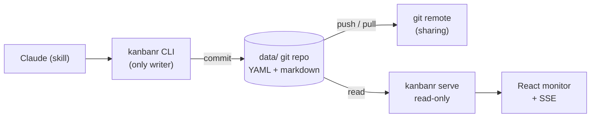

# Data flow

How a change moves through kanbanr — rendered live from a Mermaid code block:

Diagrams can be authored as Mermaid (above) **or** embedded as images (see the Overview), so any
tool that exports PNG/SVG works too.
