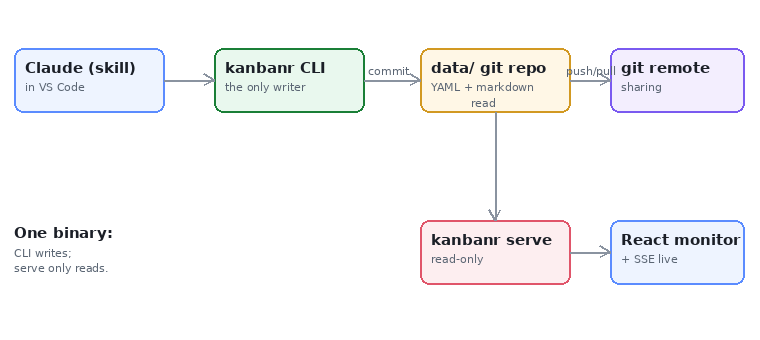

# Architecture overview

kanbanr is **one binary**. The `kanbanr` CLI is the only writer — it edits a git-backed `data/`
folder directly (driven by a Claude skill). `kanbanr serve` runs a **read-only** view daemon
(localhost, no accounts) over the same folder, serving the React monitor + an SSE stream.

- **kanbanr-core** — the engine: YAML/markdown store, the `dispatch` router, vendored-libgit2
  commits, the per-project activity changelog, validation, and export.
- **Sharing** is delegated to git remotes (e.g. GitHub) — kanbanr has no accounts of its own.

The image above is stored as a binary asset in the data folder (`design/architecture.png`) and
served by the view daemon — markdown image embedding works for any local diagram or screenshot.
